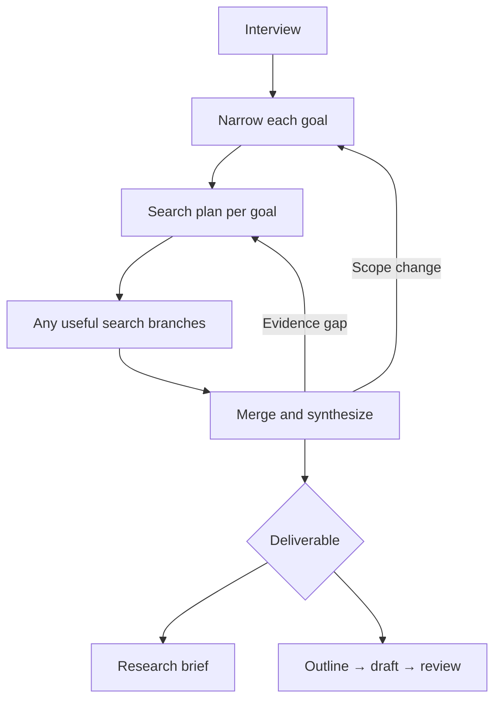

# Research Loom

A configurable research workflow graph for Claude Code and Codex. Interview first, narrow each goal to one agreed question, fan out into relevant searches, and distill traceable evidence. Draft a paper only when requested.

Each stage invokes a selectable skill. Selections and progress stay with their project, and environment overrides can change one run. The graph is orchestrated by the coding agent; it is not a deployed graph service or autonomous background runner.



## Install from the Claude Code marketplace

In Claude Code:

```text
/plugin marketplace add amaljithkuttamath/research-loom
/plugin install research-loom@research-loom
/research-loom:research-loom
```

This is a self-hosted marketplace in this repository, not a listing in Anthropic's official directory. The eval skill is `/research-loom:research-loom-eval`.

## Codex marketplace

```sh
codex plugin marketplace add amaljithkuttamath/research-loom --ref main
codex plugin add research-loom@research-loom
```

The repository includes a portable `plugin.json`, a Codex compatibility manifest, and a `.agents/plugins/marketplace.json` catalog. This adds your repository marketplace; it does not imply acceptance into an official public directory. See [OpenAI plugin packaging](https://developers.openai.com/plugins/build/plugins).

## Direct skill installation

Python 3.9 or newer is sufficient for the helpers. Search uses the tools available in your host; this bundle does not include database subscriptions, API credentials, or a browser service.

```sh
git clone https://github.com/amaljithkuttamath/research-loom.git
cd research-loom
python3 install.py --target claude
python3 install.py --target codex
```

The installer copies all ten skills into the selected host's personal skills directory. It refuses conflicting existing files. For a project-local installation, pass `--dest .claude/skills` or your Codex skill directory. Restart or reload the host so new skills are discovered.

- Claude Code: `/research-loom` and `/research-loom-eval`.
- Codex: `$research-loom` and `$research-loom-eval`.

The repository also has a Claude plugin manifest. Local plugin loading is available with `claude --plugin-dir .`; plugin commands are namespaced, for example `/research-loom:research-loom`. You do not need plugin loading when using the personal-skill installer.

## Project memory

The agent maintains this folder inside your selected research project:

```text
.research-loom/
├── config.json       # Saved stage and per-goal selections
├── state.json        # Questions, decisions, attempts and next action
└── research.json     # Papers, searches and claims
```

Initialize manually if useful:

```sh
python3 skills/research-loom/scripts/project_config.py init --project /path/to/project
python3 skills/research-loom/scripts/research_data.py init --project /path/to/project
```

Ask the agent to select a skill for a stage; it saves that selection in the current project's config. A separate project gets separate settings. Selection order is current user instruction, environment, saved per-goal choice, saved project choice, then default.

Example temporary override:

```sh
RLOOM_STAGE_SYNTHESIZE=my-synthesis-skill \
  python3 skills/research-loom/scripts/project_config.py resolve --project /path/to/project
```

Use `RLOOM_SEARCH_BRANCHES` for a JSON array of search branches. Sources are chosen by the question and discipline, rather than a fixed Scholar/arXiv list. Multiple branches can use the same source or different sources. Every branch keeps its own goal, query and provenance. A selected skill must exist; selecting it does not install it or grant tool access.

[Configuration contract](skills/research-loom/references/configuration.md) · [Node handoffs](skills/research-loom/references/node-contract.md)

## Auditable evidence

`research.json` contains three linked arrays:

- `papers`: stable source IDs, metadata and publication versions.
- `searches`: goal/branch IDs, queries, execution status and retrieved source/version links.
- `claims`: statements linked to evidence locators, verification, reading level and supporting/contradicting relationships.

A future web server can read this ordinary JSON directly. No graph database is required. Search branches return separate artifacts; the orchestrator merges shared data and validates it. Structural validation does not prove scientific claim support.

Paper synthesis records each method, reported validation, relevance to the focused question, and justified triage. It distinguishes direct evidence, indirect evidence, validation absent in inspected material, and insufficient access. Assessments stay scoped to the research goal and source version.

[Paper data contract](skills/research-loom/references/paper-data.md)

## Evaluation and release

Invoke `research-loom-eval` before shipping changes. It combines deterministic tests, actual behavioral/artifact checks, source audits and an honest release decision. Keep fixtures and failed runs; compare baseline/previous-version runs without confusing single-run observations with reliability estimates.

```sh
python3 -m unittest discover -s skills/research-loom/evals -p 'test_*.py' -v
python3 skills/research-loom/scripts/research_data.py validate --project /path/to/project
claude plugin validate --strict .
```

The v0.1.0 report records scoped dogfooding, instruction defects found and fixed, a no-skill control, and a Claude Code smoke test. Writing/reviewer workflows and repeated statistical reliability are not certified by those checks. See [release evaluation](evals/release-report.md) and the [v0.1.1 methods/validation checks](evals/methods-validation-release.md).

## Design references

Research Loom uses original implementation and instructions informed by [LangChain OpenWiki](https://github.com/langchain-ai/openwiki), [Open Deep Research](https://github.com/langchain-ai/open_deep_research), the [Agent Skills specification](https://agentskills.io/specification), and [skill evaluation guidance](https://agentskills.io/skill-creation/evaluating-skills). OpenWiki inspired the separation between agent research and deterministic bookkeeping; it is not a dependency.
