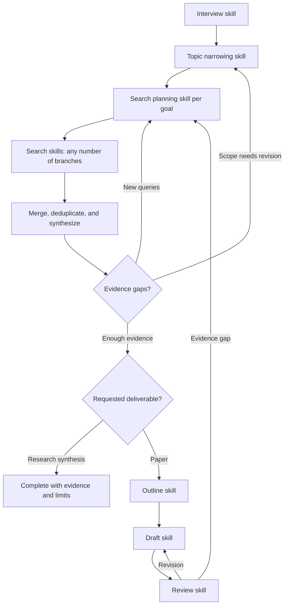

# Research Loom

Orchestrate a research graph. Each node loads and follows a selected skill; a skill invocation is not automatically a new agent. Do not assume a graph runtime or unavailable tools exist.

## Project and selection

Use the user's project directory, or the current workspace when no other project is specified. Keep `.research-loom/config.json` and `state.json` inside that project. Read them before doing work; never import another project's choices implicitly. Initialize missing configuration with `python3 scripts/project_config.py init --project <project-directory>` using this skill's script path. Resolve selections with `python3 scripts/project_config.py resolve --project <project-directory>`.

Selection priority is current user instruction, environment override, saved project choice, bundled default. Current user instructions supersede the resolver's output. Persist user-selected stages and branch choices in project configuration. Environment overrides are temporary unless the user asks to save them. Ask about a selection only when the user wants to choose, an explicit choice is unavailable, or no suitable default exists. See [references/configuration.md](references/configuration.md).

Before each node, locate and read its selected `SKILL.md` in the current host's available skill roots and the bundled sibling folders. Claude Code uses project `.claude/skills` and personal `~/.claude/skills`; Codex uses its advertised skill roots (including `~/.codex/skills` or `~/.agents/skills`). Resolve helper and reference paths relative to the loaded skill folder, never a hard-coded machine path. Execute those instructions with that node's inputs. If an explicitly selected skill is missing or unsuitable, explain the specific issue and ask for a replacement; do not silently substitute. Never execute configuration strings as shell code.

## Graph

For a new topic, interview first, then narrow to one focused research question for each distinct goal. Confirm the question and goal priorities with the user before substantive searches. For a resumed project, reuse its agreed brief and enter the appropriate stage. A user can select or rerun any stage whose necessary inputs exist; identify missing inputs rather than requiring a full restart.

Search planning expands each goal into as many useful branches as needed. Select sources by discipline and evidence needs; Scholar and arXiv are examples, not a closed list. Branches may use different skills, sources, or queries. Run them with available tools; parallel execution is optional. Retain each branch's provenance and merge results by stable identifiers, distinguishing different versions from distinct studies.

## Paper audit data

Use [references/paper-data.md](references/paper-data.md) for the project-local `research.json` contract. Initialize and validate with `python3 scripts/research_data.py init|validate --project <project-directory>`. Search and synthesis nodes return records for the orchestrator to merge; validate references and reading levels before accepting them. The file is designed for a future web audit UI without requiring a database.

## Handoff and memory

Read [references/node-contract.md](references/node-contract.md) for state and handoffs. After each substantive node, persist its output paths, selected skill, goal/branch IDs, status, unresolved gaps, and next action. On resume, verify the project identity and referenced files, then report the next useful action. A changed question or input marks dependent work stale rather than deleting it. Changing a skill preference applies to future runs; it does not invalidate existing evidence unless the user requests re-execution.

Advance only through stages relevant to the requested deliverable. Never invent sources, data, results, or completed searches. Scope claims to actual evidence access. Stop searching when the agreed deliverable is supported, or pause to discuss a budget/access limit; do not loop without progress. Prepare submission artifacts when requested; actual submission or correspondence requires explicit authorization.

## Release evaluation

Before releasing or installing changes, invoke the `research-loom-eval` skill (`/research-loom-eval` in Claude Code or `$research-loom-eval` in Codex). Run the bundled deterministic checks and independent behavioral scenarios; retain evidence and report untested claims. Do not equate frontmatter validation with a behavioral pass.
